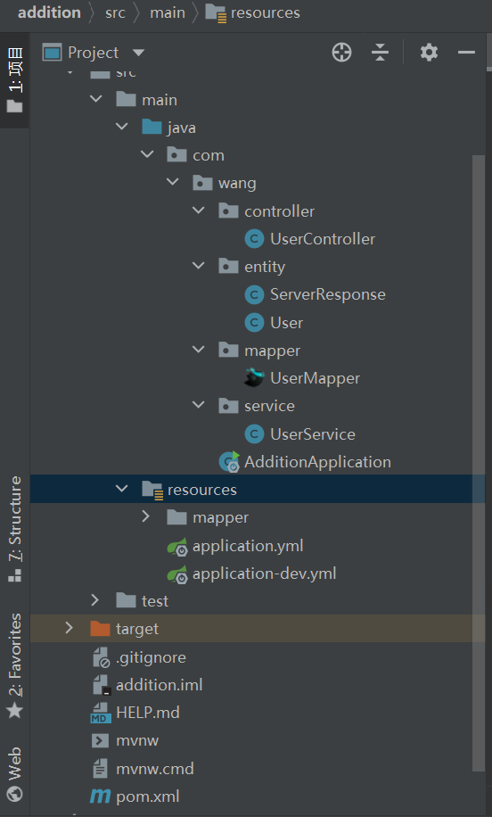

<!--
 * @Author       : Mr.Wang
 * @Date         : 2020-12-16 17:48:21
 * @FilePath     : /Note/task5.md
 * @Description  : task5
-->
[toc]

>IDE: IDEA  
DB: MySql  
JDK: Java8

# 创建项目

一、创建项目

1. 在IDEA中新建Spring Initializr项目
2. 创建项目的文件结构以及JDK的版本
   1. maven
   2. Java
   3. jar
3. 选择项目所需的依赖

4. 修改项目名

创建完成后IDEA会自动生成文件
修改pom.xml
```xml
        <dependency>
            <groupId>mysql</groupId>
            <artifactId>mysql-connector-java</artifactId>
            <scope>runtime</scope>
        </dependency>

-->     <dependency>
            <groupId>mysql</groupId>
            <artifactId>mysql-connector-java</artifactId>
            <scope>8.0.4</scope>
        </dependency>
```

resource下自动生成application.properties文件
在这里不使用该文件，而使用application.yml和application-dev.yml文件，并删除application.properties(SpringBoot底层会把application.yml解析为application.properties)

application.yml
```yml
spring:
  profiles:
    active: dev
```

application-dev.yml
```yml
server:
  port: 8080 #配置端口号

spring:
  datasource:
    username: root
    password: 123456
    url: jdbc:mysql://localhost:3306/task5?useUnicode=true&characterEncoding=utf-8&useSSL=true&serverTimezone=UTC&autoReconnect=true 
    #MySql8以上要添加?后的内容才可以成功连接
    driver-class-name: com.mysql.cj.jdbc.Driver
    #要使用com.mysql.cj.jdbc.Driver 而不能使用com.mysql.jdbc.Driver

mybatis:
  mapper-locations: classpath:mapper/*Mapper.xml
  #配置mapper路径
  #mapper/*Mapper.xml需在resource下创建mapper文件夹然后创建*Mapper.xml,作为resource方式加载的映射文件
  type-aliases-package: com.wang.entity
  #指定POJO扫描包来让mybatis自动扫描到自定义POJO
  #POJO（Plain Ordinary Java Object）简单的Java对象

#showSql
#日志跟踪记录
logging:
  level:
    com:
      wangbingzhi:
        mapper : debug
```

两个yml文件的意思：
>这是在项目中配置多套环境的配置方法。
>
>因为现在一个项目有很多环境，开发环境，测试环境，准生产环境，生产环境，每个环境的参数不同，所以我们就可以把每个环境的参数配置到yml文件中，这样在想用哪个环境的时候只需要在主配置文件中将用的配置文件写上就行如application.yml
>
>在Spring Boot中多环境配置文件名需要满足application-{profile}.yml的格式，其中{profile}对应你的环境标识，比如：
>
>application-dev.yml：开发环境
application-test.yml：测试环境
application-prod.yml：生产环境
至于哪个具体的配置文件会被加载，需要在application.yml文件中通过spring.profiles.active属性来设置，其值对应{profile}值。

文件结构如下：



# 层次结构
>1. **model层=entity层**
存放我们的实体类，与数据库中的属性值基本保持一致。
>
>2. **service层**
>- 存放业务逻辑处理，有接口还有接口的实现方法，不直接和数据库打交道，在接口的实现方法中需要导入mapper层。service层是针对我们controller。
>- 在实际开发中的Service层可能被处理为实体Service层，而不是接口，业务逻辑直接写在Service（Class，不是Interface）层中。
>
>3. **mapper层=dao层**
*现在用mybatis逆向工程生成的mapper层，其实就是dao层。*
对数据库进行数据持久化操作，直接针对数据库操作。mapper层直接跟数据库打交道，是个接口，只有方法名字，具体实现在mapper.xml文件里。
>
>4. **controller层**
控制器，导入service层，service中的方法是我们使用到的，controller通过接收前端传过来的参数进行业务操作，再返回一个指定的路径或者数据表。
>
>5. 调用关系(不精确)：Controller-->Service-->Mapper-->Mapper.xml

在main.java下的* Mapper.java中定义接口,在resource下的* Mapper.xml中用Sql语句实现，如：
```xml
    <!--查询所有-->
    <select id="getAll" resultType="com.wang.entity.User"><!--返回类型 -->
        select * from user <!--表名-->
    </select>
```

# 遇到的问题
1. 配置文件中driver-class-name: com.mysql.cj.jdbc.Driver
   要在pom.xml中将修改mysql依赖,否则.cj无法解析
2. 在service层、mapper层、controller层要分别添加@Service、@Mapper、@Controller
   *Mapper层也可替换@Repository*
   *Controller层也可替换为@RestController = @ResponseBody + @Controller*
3. 无法返回自定义的json格式的数据
   定义ServerResponse实体类实现Serializable空接口，即可序列化返回数据，使其达到预期效果。
   ***在ServerResponse实体类中必须要生成getter和setter方法***

# 名词解释
>**JavaBean**
JavaBean是公共Java类，但是为了编辑工具识别，需要满足至少三个条件：有一个public默认构造器（例如无参构造器,）属性使用public 的get，set方法访问，也就是说设置成private，同时get，set方法与属性名的大小也需要对应。例如属性name，get方法就要写成，public String getName(){},N大写。需要序列化

>**Java 序列化**
Java 提供了一种对象序列化的机制，该机制中，一个对象可以被表示为一个字节序列，该字节序列包括该对象的数据、有关对象的类型的信息和存储在对象中数据的类型。
>
>将序列化对象写入文件之后，可以从文件中读取出来，并且对它进行反序列化，也就是说，对象的类型信息、对象的数据，还有对象中的数据类型可以用来在内存中新建对象。
>
>类ObjectInputStream 和 ObjectOutputStream 是高层次的数据流，它们包含反序列化和序列化对象的方法。
>
>通过实现Serializable空接口，可以标识一个类的对象可以被序列化。

>**Spring中的注解**
@Repository、@Service、@Controller，分别对应存储层Bean，业务层Bean，和展示层Bean
>1. @Repository 只能标注在 DAO 类上，它用于将数据访问层(DAO层)的类标识为 Spring Bean，同时它还能将所标注的类中抛出的数据访问异常封装为 Spring 的数据访问异常类型。Spring本身提供了一个丰富的并且是与具体的数据访问技术无关的数据访问异常结构，用于封装不同的持久层框架抛出的异常，使得异常独立于底层的框架。
>2. @Service 通常作用在业务层，但是目前该功能与 @Component 相同。
>3. @Constroller 通常作用在控制层，但是目前该功能与 @Component 相同
>4. @Component 是一个泛化的概念，仅仅表示一个组件 (Bean) ，可以作用在任何层次。
>5. @ResponseBody返回json格式的数据